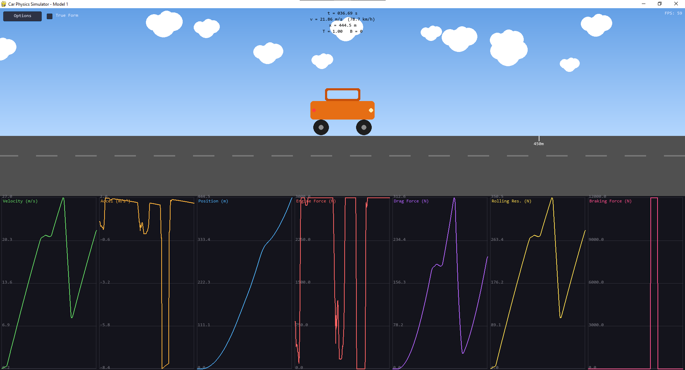

# Car Physics

Main reference: [Macro Monster's Car Physics Guide](https://www.asawicki.info/Mirror/Car%20Physics%20for%20Games/Car%20Physics%20for%20Games.html).

Check out the learning journey on my blog: [yuk068.github.io](https://yuk068.github.io/)

I try to break down each model both mathematically (continuous math) and implement them in code.

## Roadmap

```
- [x] Model 1: Longitudinal Point Mass (1D)
    - Straight Line Physics
    - Magic Constants
    - Braking
- [ ] Model 2: Load Transfer Without Traction Limits (1D)
    - Weight Transfer
- [ ] Model 3: Engine Torque + Gearing without Slip (1D)
    - Engine Force
    - Gear Ratios
    - Drive Wheel Acceleration (simplified)
- [ ] Model 4: Wheel Rotational Dynamics (1D)
    - Drive Wheel Acceleration (full)
- [ ] Model 5: Slip Ratio + Traction Curve (1D)
    - Slip Ratio & Traction Force
- [ ] Model 6: Low-Speed Kinematic Turning (2D)
    - Curves (low speed)
- [ ] Model 7: High-Speed Lateral Tire Model (2D)
    - High Speed Turning
- [ ] Model 8: Full Coupled Tire Model (2D)
```

## Showcase

- **Model 1: Longitudinal Point Mass (1D)**

